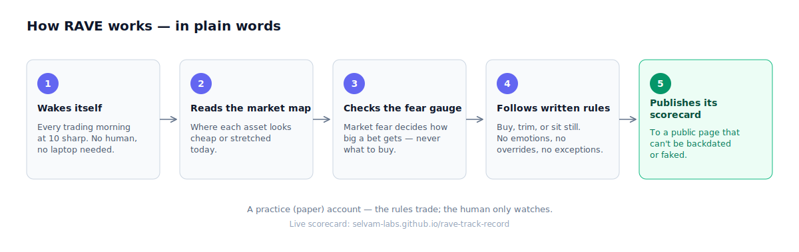
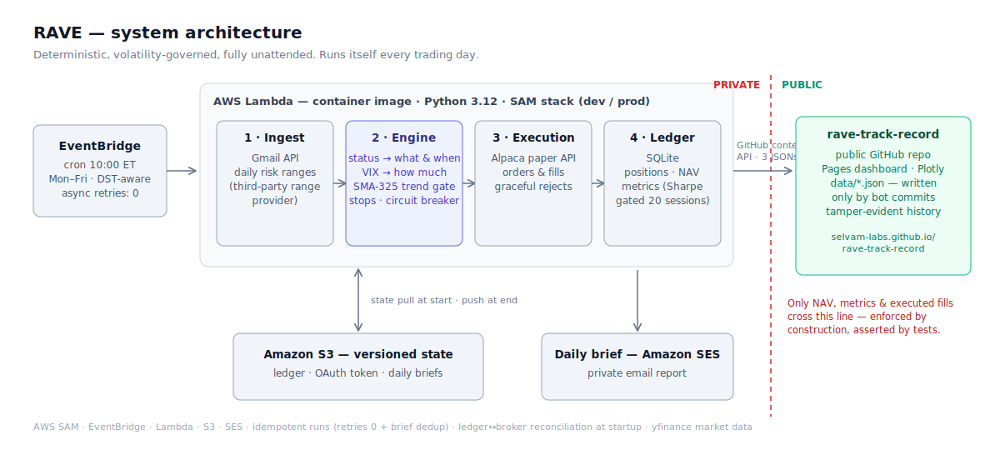

# RAVE — Raja Automated Volatility Engine

**A deterministic, volatility-governed trading system with a public, tamper-evident track record.**

[**→ Live track record**](https://selvam-labs.github.io/rave-track-record/)

---

## Abstract

RAVE turns a daily set of per-instrument range signals into position decisions,
sizes them by the prevailing volatility regime, executes against a brokerage paper
account, and publishes its equity curve here every trading day — with no human in
the loop.

One thesis drives the design: **a signal decides *what* and *when*; volatility
decides *how much*.** Direction and timing come from a rules-based status on each
instrument. Position size is capped by a VIX-regime governor. The engine is
deterministic — same inputs, same orders — which makes it testable, auditable, and
honest about its own record.

This repository is the public artifact: the live track record and this write-up.
The source code is private.

### In plain words



---

## 1. Why build this

1. **Discretion doesn't audit.** A human trader's track record can't be separated
   from memory bias after the fact. Fixed rules executed by a machine measure *the
   rules*, not the mood.
2. **Size kills before signals do.** Most blow-ups are oversizing into volatility,
   not bad direction calls. RAVE makes size a pure function of the VIX regime.
3. **A public record should be unfakeable.** Every day's numbers land here via an
   automated bot commit. GitHub's timestamps make backfilling a flattering history
   impossible — the commit log *is* the audit trail.

RAVE trades a brokerage **paper** account. It is a research and engineering
artifact, not investment advice (see Disclaimers).

---

## 2. Architecture



```
   Daily inputs                    Engine                       Outputs
┌────────────────────┐   ┌─────────────────────────┐   ┌─────────────────────┐
│ range + status per │   │ status → direction/time │   │ broker paper orders │
│   instrument       │──►│ VIX regime → size cap   │──►│ SQLite ledger + NAV │
│ prices, VIX,       │   │ trend & breadth filters │   │ daily email brief   │
│   breadth          │   │ risk rules              │   │ this dashboard      │
└────────────────────┘   └─────────────────────────┘   └─────────────────────┘
```

The pipeline runs unattended at **10:00 AM ET, Mon–Fri**, on AWS Lambda
(container image, Python 3.12) triggered by a DST-aware EventBridge schedule.
State — position ledger, NAV history, daily briefs — persists in versioned S3.
Signal inputs are ingested automatically each morning. No laptop involved.

---

## 3. Methodology

### 3.1 Status as signal

Each instrument carries a daily status derived from a third-party risk-range
provider: near the bottom of its expected range (buy zone), near the top
(sell/trim zone), inside it, or broken out. That status is the primary trigger.
RAVE doesn't predict — it reacts to where price sits in its expected band.

> The range provider's proprietary values are not redistributed here. This
> write-up covers only RAVE's own logic, built on top of a generic status.

### 3.2 The VIX-regime governor

RAVE's core idea: volatility sets a hard per-direction ceiling on position size,
in six bands.

| VIX band | Long target | Short target | Action |
|----------|-------------|--------------|--------|
| < 18     | full        | 0%           | longs build; shorts exit |
| [18, 19) | hold        | hold         | freeze |
| [19, 22) | half        | half         | build or trim toward |
| [22, 27) | hold        | hold         | freeze |
| [27, 29) | 1% floor    | 1% floor     | trim only |
| ≥ 29     | 1% floor    | 1% floor     | trim only |

The same buy signal that builds a full position at VIX 15 is capped at a 1% floor
at VIX 28. **VIX caps, status times.** Builds scale in via fixed 25% tranches —
never a full position on one print. The interleaved *freeze* bands act as
hysteresis: the book doesn't churn when the VIX oscillates around a boundary.

### 3.3 Filters

- **325-day SMA trend gate** — builds are vetoed against the long-term trend; a
  close crossing it against an open position forces a full exit.
- **Breadth override** — extreme market-breadth readings can override the trend
  veto (mean-reversion at washouts and blow-offs).

### 3.4 Leveraged proxies

Long side only, calm regime only: when the volatility budget is cheapest, RAVE
expresses conviction through a leveraged ETF instead of the plain exposure —
QQQ→TQQQ, SPY→SPXL, SOXX→SOXL, IBIT→BITX, GDX→NUGT, XLE→ERX. Never on shorts,
never in an elevated or stressed regime. Held proxies are marked and stopped at
their **own** price, not the underlying's.

---

## 4. Risk rules

- **−10% hard stop** per position, on the instrument actually held.
- **−10% portfolio drawdown circuit breaker.**
- **Max 20 concurrent positions; no averaging down.**
- **Universe discipline** — an instrument that leaves the daily watchlist is
  exited that session; the engine never holds what it has no signal for. A
  parse-health gate stops a malformed input from mass-liquidating the book.

---

## 5. Engineering properties

The parts that took the most care are the ones that don't show up on the chart:

- **Deterministic and tested.** The signal engine and the signal→order glue have
  separate test suites. Same inputs, same orders, every time.
- **Idempotent runs.** Async retries are disabled and briefs are de-duplicated, so
  a transient failure can never double-submit orders.
- **Ledger↔broker reconciliation.** Every live run diffs its own ledger against
  the broker account at startup and flags any drift at the top of the daily brief.
- **Graceful degradation.** One rejected order (a non-shortable asset, a data gap)
  is logged and skipped; it never aborts the rest of the book.
- **Privacy by construction.** The publisher reads only the engine's own NAV,
  metrics, and executed fills. An automated test asserts that no signal-source
  term can appear in any published file.

---

## 6. Track record

The [dashboard](https://selvam-labs.github.io/rave-track-record/) updates every
trading day by bot commit. The clean record begins **June 10, 2026** on a
$1,000,000 paper account.

Metrics: total and annualized return, annualized volatility, Sharpe, max and
current drawdown, win rate, average win/loss, profit factor, realized P&L.

**Sharpe is gated** behind 20 sessions of data ("building — N/20" until then),
because a Sharpe ratio on a handful of days is noise. The gate is deliberate
honesty, not a limitation.

---

## 7. Honest limitations

- The live record is young; annualized statistics are gated until they mean something.
- The breadth feed currently defaults off when unavailable, so breadth overrides
  don't yet fire.
- A sector-concentration cap is specified but not yet enforced; position count and
  volatility sizing are today's concentration guards.
- Paper only. Real capital would demand slippage modeling, borrow handling, and
  tax-lot accounting — out of scope for the public track-record goal.

---

## Disclaimers

RAVE trades a paper (simulated) account. Nothing here is investment advice or a
solicitation. Simulated performance does not predict future results. The system
consumes a third-party data product under that provider's terms and does not
redistribute its proprietary values; only RAVE's own simulated performance is
published. Source code is private.

---

*A personal engineering project in deterministic systematic trading,
volatility-based risk sizing, and cloud-native automation.*
