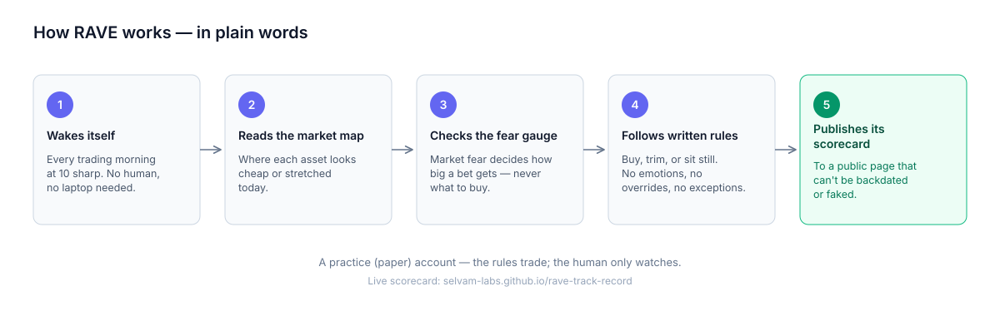
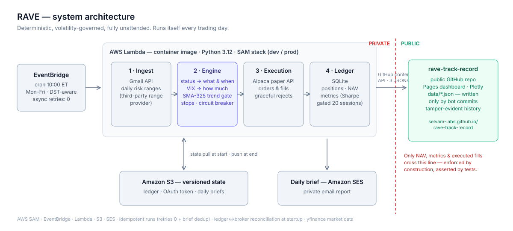

# RAVE — Regime-Adaptive Volatility Engine

**A deterministic, volatility-governed trading system with a public, tamper-evident track record.**

[**→ Live track record**](https://selvam-labs.github.io/rave-track-record/)

---

## Abstract

RAVE turns a daily set of per-instrument range signals into position decisions,
sizes them by the prevailing volatility regime, executes against a brokerage paper
account, and publishes its equity curve here every trading day — with no human in
the loop.

One thesis drives the design: **a signal decides *what* and *when*; volatility
decides *how much*.** Direction and timing come from where price sits inside each
instrument's expected range. Position size is capped by a VIX-regime governor. The
engine is deterministic — same inputs, same orders — which makes it testable,
auditable, and honest about its own record.

This repository is the public artifact: the live track record and this write-up.
The source code is private.

### In plain words



---

## 1. Why build this

1. **Discretion doesn't audit.** A human trader's track record can't be separated
   from memory bias after the fact. Fixed rules executed by a machine measure *the
   rules*, not the mood.
2. **Size kills before signals do.** Most blow-ups are oversizing into volatility,
   not bad direction calls. RAVE makes size a pure function of the VIX regime.
3. **A public record should be unfakeable.** Every day's numbers land here via an
   automated bot commit. GitHub's timestamps make backfilling a flattering history
   impossible — the commit log *is* the audit trail.

RAVE trades a brokerage **paper** account. It is a research and engineering
artifact, not investment advice (see Disclaimers).

---

## 2. Architecture



```
   Daily inputs                    Engine                       Outputs
┌────────────────────┐   ┌─────────────────────────┐   ┌─────────────────────┐
│ range per          │   │ position in range →     │   │ broker paper orders │
│   instrument       │──►│   direction / timing    │──►│ SQLite ledger + NAV │
│ prices, VIX,       │   │ VIX regime → size cap   │   │ daily email brief   │
│   breadth          │   │ trend filter, risk rules│   │ this dashboard      │
│                    │   │ idle cash → T-bills     │   │                     │
└────────────────────┘   └─────────────────────────┘   └─────────────────────┘
```

The pipeline runs unattended at **10:00 AM ET, Mon–Fri**, on AWS Lambda
(container image, Python 3.12) triggered by a DST-aware EventBridge schedule.
State — position ledger, NAV history, daily briefs — persists in versioned S3.
Signal inputs are ingested automatically each morning. No laptop involved.

---

## 3. Methodology

### 3.1 Position in range as signal

Each instrument carries a daily expected range from a third-party provider. RAVE
reads where price sits inside that range and reacts — it does not predict.

**Entry:** anywhere in the **lower half** of the range, adding 25% of the
instrument's volatility-governed target per qualifying day.

**Exit:** RAVE does *not* trim into strength. It reduces only when an instrument's
own range **low** makes consecutive lower lows — to 75% of target after three
sessions, 50% after six, and no deeper. It cuts on structural deterioration, not
on success.

That asymmetry is deliberate and was learned the hard way: the original design
trimmed at the top of the range, which fired about twice as often as its buy
trigger and left the book unable to accumulate. See
[CHANGELOG.md](CHANGELOG.md) (2026-08-15) and [BACKTEST.md](BACKTEST.md).

> The range provider's proprietary values are not redistributed here. This
> write-up covers only RAVE's own logic, built on top of a generic position-in-range
> reading.

### 3.2 The VIX-regime governor

RAVE's core idea: volatility sets a hard per-direction ceiling on position size,
in six bands.

| VIX band | Long target | Short target | Action |
|----------|-------------|--------------|--------|
| < 18     | full        | 0%           | longs build; shorts exit |
| [18, 19) | hold        | hold         | freeze |
| [19, 22) | half        | half         | build or trim toward |
| [22, 27) | hold        | hold         | freeze |
| [27, 29) | 1% floor    | 1% floor     | trim only |
| ≥ 29     | 1% floor    | 1% floor     | trim only |

The same buy signal that builds a full position at VIX 15 is capped at a 1% floor
at VIX 28. **Volatility caps, position-in-range times.** Builds scale in at 25% of
the current band's target —
never a full position on one print. The interleaved *freeze* bands act as
hysteresis: the book doesn't churn when the VIX oscillates around a boundary.
The [22, 27) band freezes rather than trims for the same reason — mid-stress
chop is where forced de-risking whipsaws a book, so actual trimming is reserved
for the ≥ 27 stress bands, and the freeze damps re-leveraging on the way back
down.

### 3.3 Filters

- **325-day SMA trend gate** — builds are vetoed against the long-term trend; a
  close crossing it against an open position forces a full exit.
- **Breadth override** — extreme market-breadth readings can override the trend
  veto (mean-reversion at washouts and blow-offs).

### 3.4 Leveraged instruments — removed 2026-08-15

RAVE used to express conviction in a calm regime through a leveraged ETF instead of
the plain exposure. **It no longer does. The book is 1x only.**

This was not a change of taste — it was forced by measurement, and the way it was
found is worth stating. The 2026-08-15 entry-and-exit redesign was tested against a
risk bar written down *before* the result was known: maximum drawdown ≤12%, return
above T-bills, average exposure ≥35%. The first version kept leveraged instruments
and **failed** — 12.3% drawdown, and no additional return at all over the previous
version despite carrying double the exposure.

Attribution isolated the cause. A wider entry trigger buys considerably more
leveraged exposure into the same −10% stop, and a 3.3% move in an underlying is a
10% move in a 3x instrument. The system was manufacturing stop-outs. Removing
leveraged instruments is what produced the version that passed.

Positions opened under the old rule were closed in a single migration on the cutover
date; the realized profit and loss from that migration appears in the record. See
[CHANGELOG.md](CHANGELOG.md) and [BACKTEST.md](BACKTEST.md).

---

## 4. Risk rules

- **−10% hard stop** per position, on the instrument actually held.
- **−10% portfolio drawdown circuit breaker.**
- **Max 20 concurrent positions; no averaging down.** Treasury holdings do not
  consume a slot — cash management never crowds out a signal.
- **Universe discipline** — an instrument that leaves the daily watchlist is
  exited that session; the engine never holds what it has no signal for. A
  parse-health gate stops a malformed input from mass-liquidating the book.

---

## 5. Engineering properties

The parts that took the most care are the ones that don't show up on the chart:

- **Deterministic and tested.** The signal engine and the signal→order glue have
  separate test suites. Same inputs, same orders, every time.
- **Idempotent runs.** Async retries are disabled and briefs are de-duplicated, so
  a transient failure can never double-submit orders.
- **Ledger↔broker reconciliation.** Every live run diffs its own ledger against
  the broker account at startup and flags any drift at the top of the daily brief.
- **Graceful degradation.** One rejected order (a non-shortable asset, a data gap)
  is logged and skipped; it never aborts the rest of the book.
- **Privacy by construction.** The publisher reads only the engine's own NAV,
  metrics, and executed fills — never the signal source. Raw engine reasons are
  mapped to neutral rule labels rather than exported. Automated tests assert that
  no signal-source term survives in any published payload *or in any published
  write-up*, this file included.

To *feel* the system rather than read about it: a
[redacted sample of one real daily brief](docs/sample-brief.md) — signals in,
decisions made, orders out, reconciliation at the top — is included in this repo.

---

## 6. Track record

The [dashboard](https://selvam-labs.github.io/rave-track-record/) updates every
trading day by bot commit. The clean record begins **June 10, 2026** on a
$1,000,000 paper account.

The record is tamper-evident by mechanism, not by promise: GitHub's push
timestamps and event log are recorded server-side and can't be rewritten,
`main` is protected against force-pushes and history deletion, and the
`data/` files are written only by the engine's bot identity — human commits
never touch them.

Metrics: total and annualized return, annualized volatility, Sharpe, max and
current drawdown, win rate, average win/loss, profit factor, realized P&L.

**Sharpe is gated** behind 20 sessions of data ("building — N/20" until then),
because a Sharpe ratio on a handful of days is noise. The gate is deliberate
honesty, not a limitation.

**Benchmark.** Return figures are measured against a control that holds the index
at RAVE's *own average exposure*, with the remainder in T-bills — because being
more invested raises returns by itself, and that is beta, not skill. On the
five-year research window RAVE underperforms that control by roughly 1.5 points a
year. It is a risk tool, not an alpha engine; the full record, including every
rejected idea, is in [BACKTEST.md](BACKTEST.md).

**Trade statistics restart at the 2026-08-15 strategy change.** Win rate, profit
factor and average win/loss are counted from that date forward — a figure blended
across the change describes neither system. The equity curve is continuous and the
change date is marked on it.

---

## 7. Honest limitations

**RAVE does not beat the index, and it is not designed to.** Measured against a
control that holds the index at RAVE's *own average exposure*, it underperforms by
roughly 1.5 points a year. Five years of research did not produce a version that
beat that control — 13 position-management configurations, three volatility-timing
schemes, a breakout system and a reversal signal all failed. What RAVE delivers is
participation with a bounded drawdown (11.3% maximum against the index's 24.5% over
the same window) and deterministic, unattended execution. The complete research
record, including every rejected idea, is in [BACKTEST.md](BACKTEST.md).

**The test window is one market cycle, and mostly a rising one.** It contains a
single sustained bear market and excludes the 2020 crash entirely. That makes the
drawdown claim — the headline — the *least* proven thing here: this system has never
been tested through a fast, gapping crash.

- The live record is young; annualized statistics are gated until they mean something.
- The breadth feed currently defaults off when unavailable, so breadth overrides
  don't yet fire.
- A sector-concentration cap is specified but not yet enforced; position count and
  volatility sizing are today's concentration guards.
- Paper only. Real capital would demand slippage modeling, borrow handling, and
  tax-lot accounting — out of scope for the public track-record goal.
- The strategy changed on 2026-08-15. Statistics quoted across that date blend two
  different systems; trade statistics are counted from the change forward.
- Uninvested cash is held in short-term Treasury bills. Roughly half the account
  sits there by design, so that yield is a material part of the return. Treasury
  holdings are excluded from win rate and profit factor — those measure the
  signal's decisions, not where idle money waits — but their yield does count in
  account value and every risk statistic.

---

## Disclaimers

RAVE trades a paper (simulated) account. Nothing here is investment advice or a
solicitation. Simulated performance does not predict future results. The system
consumes a third-party data product under that provider's terms and does not
redistribute its proprietary values; only RAVE's own simulated performance is
published. Source code is private.

---

*A personal engineering project in deterministic systematic trading,
volatility-based risk sizing, and cloud-native automation.
© 2026 Raja Selvam — all rights reserved ([LICENSE](LICENSE)); published for
viewing and evaluation, not for redistribution.*
